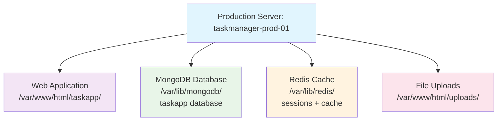

# TaskManager Pro - Docker Migration Lab

## 🚨 PRODUCTION SYSTEM MIGRATION SCENARIO

**Context**: You are inheriting a live production task management system that must be migrated to Docker containers while maintaining 100% data integrity and service availability. This system is actively used by your organization's security team.

## Current Production Environment

### System Architecture



### Live Data That MUST Be Preserved

- **MongoDB**: 10 active tasks, 4 user accounts, audit logs
- **Redis**: Active user sessions, cached data, rate limiting counters
- **File System**: Security documents, audit reports, certificates
- **Application**: Configuration, logs, user-uploaded files

### Current System Status

- **Users**: 4 team members (admin, developer, analyst, manager)
- **Active Tasks**: 10 tasks across different priorities and statuses
- **Active Sessions**: 3 concurrent users logged in
- **File Uploads**: 3 critical security documents
- **Cache Data**: Performance optimization and session management

## Lab Objectives

Students will learn to:

1. **Analyze Production Systems**

   - Identify all components and dependencies
   - Map data storage locations and formats
   - Document current configuration and state

2. **Plan Zero-Downtime Migration**

   - Create comprehensive migration checklist
   - Design rollback procedures
   - Plan data preservation strategies

3. **Execute Docker Migration**

   - Export all production data safely
   - Create appropriate Dockerfiles
   - Configure Docker networks and volumes
   - Import data into containerized services

4. **Validate Migration Success**
   - Verify all data integrity
   - Test application functionality
   - Confirm performance benchmarks

## Directory Structure

```text
lab/
├── web/                    # PHP Application
│   ├── index.html         # Task management interface
│   ├── style.css          # Application styling
│   ├── script.js          # Frontend JavaScript
│   ├── config.php         # Database/Redis connections
│   ├── app.php            # Core application logic
│   └── api.php            # REST API endpoints
├── database/              # MongoDB Setup
│   ├── schema.js          # Database structure
│   └── seed.js            # Production data simulation
├── cache/                 # Redis Configuration
│   ├── redis.conf         # Production Redis config
│   └── production_data.redis # Cache/session data
├── uploads/               # User Files
│   ├── ssl_certificate_renewal_plan.pdf
│   ├── security_audit_checklist.txt
│   └── backup_verification_log.txt
└── docker-examples/       # Student workspace
```

## Pre-Migration System State

### Application Features

- Task creation, assignment, and status tracking
- User authentication and session management
- File upload capability for task attachments
- Real-time dashboard with statistics
- Activity logging and audit trail
- Redis-based caching for performance

### Technical Stack

- **Frontend**: HTML5, CSS3, JavaScript (ES6)
- **Backend**: PHP 8.x with MongoDB and Redis clients
- **Database**: MongoDB 6.0+ with production indexes (requires `mongosh` client)
- **Cache**: Redis 7.0+ with persistence enabled (configuration updated for local directories)
- **Web Server**: Apache/Nginx with PHP-FPM

> **Note**: This lab requires the modern `mongosh` MongoDB shell client. The legacy `mongo` command has been deprecated and replaced with `mongosh` in recent MongoDB versions.

> **Redis Configuration**: The Redis configuration has been updated to use local directories (`./cache/`) instead of system directories to avoid permission issues during lab setup.

## Migration Requirements

### Data Preservation Checklist

- [ ] Export MongoDB collections with all documents
- [ ] Backup Redis RDB and AOF files
- [ ] Archive all uploaded files with permissions
- [ ] Document all environment configurations
- [ ] Record all service dependencies and ports

### Container Requirements

- [ ] Web service container (PHP + Apache/Nginx)
- [ ] MongoDB service container with persistent storage
- [ ] Redis service container with data persistence
- [ ] Proper networking between all services
- [ ] Volume mounts for data persistence

### Testing Requirements

- [ ] All 10 tasks visible and editable
- [ ] User authentication working
- [ ] File uploads functional
- [ ] Session management operational
- [ ] Performance comparable to original system

## Student Deliverables

1. **Migration Plan Document**

   - Step-by-step migration procedures
   - Data backup and recovery procedures
   - Rollback plan for migration failure
   - Timeline and risk assessment

2. **Docker Configuration**

   - Dockerfiles for each service
   - docker-compose.yml for orchestration
   - Volume and network configurations
   - Environment variable management

3. **Data Migration Scripts**

   - MongoDB export/import procedures
   - Redis data migration commands
   - File system migration procedures
   - Validation and verification scripts

4. **Documentation**
   - System architecture diagram
   - Service communication flows
   - Maintenance and troubleshooting guide
   - Performance benchmarking results

## Setup Instructions

> **⚠️ Important**: You will need **4 terminal windows** for this lab:
>
> - **Terminal 1**: MongoDB database server
> - **Terminal 2**: Redis cache server
> - **Terminal 3**: PHP web application server
> - **Terminal 4**: Testing and verification commands
>
> **📋 Setup Overview**: We'll install MongoDB, Redis, and PHP, then start the production system locally before planning the Docker migration.

### Step 1: Update System and Install Base Packages

```bash
# Update package repositories
sudo apt update && sudo apt upgrade -y

# Install essential packages
sudo apt install -y curl wget gnupg2 software-properties-common apt-transport-https ca-certificates lsb-release
```

### Step 2: Install MongoDB Server and Client

```bash
# Import MongoDB GPG key
curl -fsSL https://www.mongodb.org/static/pgp/server-7.0.asc | sudo gpg -o /usr/share/keyrings/mongodb-server-7.0.gpg --dearmor

# Add MongoDB repository
sudo nano /etc/apt/sources.list.d/mongodb-org-7.0.list
```

**Copy and paste this line into the file:**

```
deb [ arch=amd64,arm64 signed-by=/usr/share/keyrings/mongodb-server-7.0.gpg ] https://repo.mongodb.org/apt/debian bookworm/mongodb-org/7.0 main
```

**Save and exit** (Ctrl+X, then Y, then Enter)

```bash

# Update package list and install MongoDB
sudo apt update
sudo apt install -y mongodb-org mongodb-mongosh

# Enable and start MongoDB service
sudo systemctl enable mongod
sudo systemctl start mongod

# Verify MongoDB installation
sudo systemctl status mongod
mongosh --eval "db.runCommand({connectionStatus: 1})"
```

### Step 3: Install Redis Server

```bash
# Install Redis server
sudo apt install -y redis-server

# Enable and start Redis service
sudo systemctl enable redis-server
sudo systemctl start redis-server

# Verify Redis installation
sudo systemctl status redis-server
redis-cli ping  # Should return "PONG"
```

### Step 4: Install PHP and Required Extensions

```bash
# Install PHP and core extensions
sudo apt install -y php8.2 php8.2-cli php8.2-fpm php8.2-dev php8.2-xml php8.2-curl php8.2-mbstring php8.2-zip

# Install MongoDB PHP extension
sudo apt install -y php8.2-mongodb

# Install Redis PHP extension
sudo apt install -y php8.2-redis

# Install additional useful extensions
sudo apt install -y php8.2-common

# Verify PHP installation and extensions
php --version
php -m | grep -E "(mongodb|redis)"  # Should show both extensions loaded
```

### Step 5: Configure PHP for Application

```bash
# Create PHP configuration for larger file uploads
sudo nano /etc/php/8.2/cli/conf.d/99-taskmanager.ini
```

**Copy and paste this content into the file:**

```ini
; TaskManager Pro Configuration
upload_max_filesize = 5M
post_max_size = 6M
max_execution_time = 300
memory_limit = 256M
session.save_handler = redis
session.save_path = "tcp://127.0.0.1:6379"
```

**Save and exit** (Ctrl+X, then Y, then Enter)

```bash
# Copy configuration to FPM if planning to use with web server later
sudo cp /etc/php/8.2/cli/conf.d/99-taskmanager.ini /etc/php/8.2/fpm/conf.d/

# Verify PHP extensions are loaded
php -m | grep -E "(mongodb|redis)"  # Should show both extensions
```

### Step 6: Navigate to Application Directory

```bash
# Navigate to the lab directory (adjust path as needed)
cd ~/Docker-Workshop/assets/lab/

# Verify all application files are present
ls -la web/ database/ cache/ uploads/
```

### Step 7: Configure Application Directory Structure

```bash
# For development/lab environment, use local directories
# Create local upload directory with proper permissions
mkdir -p uploads_local
chmod 755 uploads_local

# Copy sample upload files to local directory
cp -r uploads/* uploads_local/

# Update config.php to use local upload directory for lab environment
nano web/config.php
```

**In nano, find this line:**

```php
define('UPLOAD_DIR', '/var/www/html/uploads/');
```

**Replace it with:**

```php
define('UPLOAD_DIR', './uploads_local/');
```

**Save and exit** (Ctrl+X, then Y, then Enter)

### Step 8: Set Up MongoDB Database

```bash
# Create database directory for local MongoDB instance
mkdir -p ./database_data

# Start MongoDB with local data directory (keep this terminal open - Terminal 1)

# Stop system MongoDB if running to avoid port conflicts
sudo systemctl stop mongod

# Start MongoDB with local data directory
mongod --dbpath ./database_data --logpath ./database_data/mongodb.log --fork

# Set up database schema and import production data
mongosh < database/schema.js    # Creates database structure and indexes
mongosh < database/seed.js     # Imports 10 tasks, 4 users, and activity logs

# Verify database setup (should show: Users: 4, Tasks: 10, Activity Logs: 12)
mongosh taskapp --eval "print('Users: ' + db.users.countDocuments()); print('Tasks: ' + db.tasks.countDocuments()); print('Activity Logs: ' + db.activity_logs.countDocuments());"
```

> **Note**: If you see warnings about deprecated `mongo` command, that's normal - we're using the modern `mongosh` client.

### Step 9: Set Up Redis Cache

```bash
# Stop system Redis if running to avoid port conflicts
sudo systemctl stop redis-server

# Start Redis with application configuration (keep this terminal open - Terminal 2)
redis-server cache/redis.conf &

# Load production cache data (user sessions, app config, activity logs)
redis-cli < cache/production_data.redis

# Verify Redis setup
redis-cli ping                      # Should return "PONG"
redis-cli GET "config:app_version"  # Should return "2.1.0"
redis-cli LLEN "recent_activity"    # Should return 3
```

> **Note**: You may see warnings about comments in the Redis data file - this is normal behavior. Redis ignores comment lines but processes the data commands successfully.

### Step 10: Start Web Application

```bash
# Start PHP built-in web server (Terminal 3 - keep this open)
cd web/
php -S localhost:8080

# Application will be available at: http://localhost:8080
```

> **Important**: Keep this terminal open! The web server will run in the foreground and show access logs.

### Step 11: Verify Complete Application Setup

**Open a new terminal (Terminal 4) for testing:**

```bash
# Navigate back to the lab directory
cd ~/Docker-Workshop/assets/lab/

# Test MongoDB connection (should return 10)
mongosh taskapp --eval "db.tasks.countDocuments()"

# Test Redis connection (should return "PONG")
redis-cli ping

# Test web application (should find "TaskManager Pro")
curl -s http://localhost:8080 | grep "TaskManager Pro"

# Test API endpoints (should return true)
curl -s http://localhost:8080/api/tasks | grep '"success":true'
```

**If all tests pass, open your browser and visit:** http://localhost:8080

You should see the TaskManager Pro dashboard with:

- ✅ 4 user statistics cards showing task counts
- ✅ Task creation form on the left
- ✅ Task list on the right showing 10 existing tasks
- ✅ File upload functionality working

## Production Deployment Options

### Option A: Apache with PHP-FPM

```bash
# Install Apache and PHP-FPM
sudo apt install -y apache2 php8.2-fpm

# Enable required modules
sudo a2enmod proxy_fcgi setenvif rewrite
sudo a2enconf php8.2-fpm

# Create virtual host configuration
sudo nano /etc/apache2/sites-available/taskmanager.conf
```

**Copy and paste this content into the file:**

```apache
<VirtualHost *:80>
    ServerName taskmanager.local
    DocumentRoot /var/www/html/taskmanager/web

    <Directory /var/www/html/taskmanager/web>
        AllowOverride All
        Require all granted
        FallbackResource /index.html
    </Directory>

    # API routing
    RewriteEngine On
    RewriteRule ^/api/(.*)$ /api.php [QSA,L]

    ErrorLog ${APACHE_LOG_DIR}/taskmanager_error.log
    CustomLog ${APACHE_LOG_DIR}/taskmanager_access.log combined
</VirtualHost>
```

**Save and exit** (Ctrl+X, then Y, then Enter)

```bash

# Copy application files
sudo cp -r . /var/www/html/taskmanager/
sudo chown -R www-data:www-data /var/www/html/taskmanager/

# Enable site
sudo a2ensite taskmanager
sudo systemctl reload apache2
```

### Option B: Nginx with PHP-FPM

```bash
# Install Nginx and PHP-FPM
sudo apt install -y nginx php8.2-fpm

# Create Nginx configuration
sudo nano /etc/nginx/sites-available/taskmanager
```

**Copy and paste this content into the file:**

```nginx
server {
    listen 80;
    server_name taskmanager.local;
    root /var/www/html/taskmanager/web;
    index index.html;

    location / {
        try_files $uri $uri/ /index.html;
    }

    location ~ ^/api/(.*)$ {
        try_files $uri /api.php;
        fastcgi_pass unix:/var/run/php/php8.2-fpm.sock;
        fastcgi_index api.php;
        include fastcgi_params;
        fastcgi_param SCRIPT_FILENAME $document_root/api.php;
    }

    location ~ \.php$ {
        fastcgi_pass unix:/var/run/php/php8.2-fpm.sock;
        fastcgi_index index.php;
        include fastcgi_params;
        fastcgi_param SCRIPT_FILENAME $document_root$fastcgi_script_name;
    }
}
```

**Save and exit** (Ctrl+X, then Y, then Enter)

```bash

# Enable site
sudo ln -s /etc/nginx/sites-available/taskmanager /etc/nginx/sites-enabled/
sudo nginx -t && sudo systemctl reload nginx
```

### Production Data Verification

```bash
# Verify MongoDB data
mongosh taskapp --eval "db.tasks.countDocuments()"
mongosh taskapp --eval "db.users.countDocuments()"

# Verify Redis data
redis-cli ping                           # Should return "PONG"
redis-cli INFO keyspace                  # Shows database statistics
redis-cli GET "config:app_version"       # Should return "2.1.0"
redis-cli LLEN "recent_activity"         # Should return 3

# Verify uploaded files
ls -la uploads/
```

## Troubleshooting Common Issues

### MongoDB Issues

- **"command not found: mongo"**: Use `mongosh` instead of `mongo` (legacy command deprecated)
- **Syntax errors with load()**: Use `mongosh < script.js` instead of `load("script.js")` inside the shell
- **Connection refused**: Ensure `mongod --dbpath ./database/` is running in a separate terminal

### Redis Issues

- **Permission denied on /var/lib/redis**: Configuration fixed to use local `./cache/` directory
- **Comment warnings during data load**: Normal behavior - Redis doesn't understand `#` comments but data loads successfully
- **Connection refused**: Ensure `redis-server cache/redis.conf` is running

### Verification Commands

```bash
# Check if services are running
ps aux | grep mongod    # Should show MongoDB process
ps aux | grep redis     # Should show Redis process

# Test connectivity
mongosh taskapp --eval "db.tasks.countDocuments()"  # Should return 10
redis-cli ping                                        # Should return "PONG"
```

## CCDC Competition Relevance

This lab simulates real CCDC scenarios where teams must:

- **Maintain service uptime** during infrastructure changes
- **Preserve business-critical data** under time pressure
- **Document all changes** for audit and compliance
- **Work with unfamiliar applications** quickly and effectively
- **Implement security improvements** without breaking functionality

The migration planning and documentation skills developed here are directly applicable to CCDC business injects requiring infrastructure modernization, security improvements, or disaster recovery procedures.

## Important Reminders

⚠️ **This represents a LIVE PRODUCTION SYSTEM**

- All data has business value and must be preserved
- Users are actively working in the system
- Any data loss or extended downtime is unacceptable
- All changes must be documented and reversible

🔒 **Security Considerations**

- Production passwords and configurations are included
- Handle sensitive data appropriately
- Implement proper access controls in containers
- Maintain audit trails throughout migration

📊 **Performance Requirements**

- Application response time must remain acceptable
- Database query performance should not degrade
- Session management must continue working seamlessly
- File upload/download functionality must be preserved
